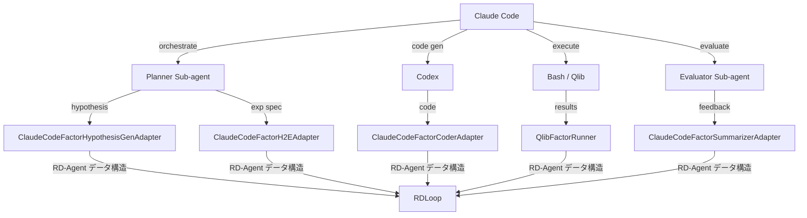

# Phase 3: 完全移行・公開準備

作成日: 2026-03-07
起点: Phase 2 の Claude Code 統合深化完了
目的: Docker/CI 環境から OpenAI 依存を除去し、Claude Code ベースの OSS として公開可能な状態にする
依存: Phase 2 完了

実装スコープ:
- `RD-Agent-with-Claudex/` と `Qlib-with-Claudex/` の公開準備
- 親 repo では `CLAUDE.md`, `docs/`, `Plans.md` を同期
- Phase 3 時点では Phase 4 に残す互換層を許容する

---

## レビュー反映事項

- 現在の両リポジトリには `CLAUDE.md` / `.claude/` / `.github/workflows/` / `docker-compose.yml` が存在しないため、「更新」ではなく「新規追加 or 必要時のみ追加」と表現を揃える。
- Qlib 側は OpenAI 依存がほぼ無いため、Phase 3 の主対象は周辺ドキュメント・フック・スキル整備であり、コアコード変更は前提にしない。
- skill/command 定義のソース置き場は Phase 1B の `docs/skills/` を正とし、Phase 3 で各実行環境向けに配備する。
- `anthropic` SDK 追加は direct provider 利用時のみ必須で、LiteLLM 経由のみなら必須ではない。Docker 更新項目は「必要なら追加」とする。

---

## Phase 3.1: Docker 環境更新

デフォルト実行経路を Claude/LiteLLM ベースへ寄せ、公開用の Docker 環境を整える。

### 対象ファイル

- `kaggle_environment.yaml` — `openai==1.48.0` の扱いを Phase 2 の結果に合わせて見直す。direct provider を使う場合のみ `anthropic>=0.39.0` を追加
- `Dockerfile` — `mle-bench`（OpenAI リポジトリ）クローン箇所を除去または代替実装に置換
- `docker-compose.yml` — 存在しないため必要なら新規追加し、環境変数を `OPENAI_API_KEY` から `ANTHROPIC_API_KEY` へ変更
- `sing_docker/` 配下 — モデル参照を `gpt-*` から `claude-*` へ更新

### タスク

| Task | 内容 | 詳細 | Status |
|------|------|------|--------|
| 3.1.1 | kaggle_environment.yaml 更新 | `openai==1.48.0` 削除、direct provider を使う場合のみ `anthropic>=0.39.0` 追加、`litellm` バージョン確認 | cc:TODO |
| 3.1.2 | Dockerfile mle-bench 判定 | `git clone https://github.com/openai/mle-bench` の用途調査、不要なら除去 | cc:TODO |
| 3.1.3 | docker-compose 環境変数 | `OPENAI_API_KEY` → `ANTHROPIC_API_KEY`、`CLAUDE_MODEL` 変数追加 | cc:TODO |
| 3.1.4 | sing_docker 設定更新 | モデル名・API エンドポイント参照を Claude 系に統一 | cc:TODO |
| 3.1.5 | Docker ビルド検証 | `docker build` 成功、デフォルト経路で必要な依存が import 可能 | cc:TODO |
| 3.1.6 | スモークテスト | コンテナ起動 → Adapter import → 簡易ファクター生成の一巡確認 | cc:TODO |

---

## Phase 3.2: CI/CD パイプライン

GitHub Actions を Anthropic ベースに移行し、品質ゲートを整備する。

### タスク

| Task | 内容 | 詳細 | Status |
|------|------|------|--------|
| 3.2.1 | GitHub Secrets 更新 | `OPENAI_API_KEY` → `ANTHROPIC_API_KEY` に置換、旧シークレット削除 | cc:TODO |
| 3.2.2 | CI ワークフロー更新 | `.github/workflows/` 内の環境変数・ステップを Claude Code 対応に修正 | cc:TODO |
| 3.2.3 | テストマトリクス整備 | unit / integration / adapter 契約テストの 3 層を CI で実行 | cc:TODO |
| 3.2.4 | Lint / 型チェック | Phase 4 まで残す許容ファイル以外で OpenAI import が増えていないことを CI で検証 | cc:TODO |
| 3.2.5 | バッジ更新 | README のバッジを新 CI ワークフローに対応させる | cc:TODO |

### CI 品質ゲート

```yaml
# .github/workflows/ci.yml 抜粋イメージ
jobs:
  lint-openai-allowlist:
    runs-on: ubuntu-latest
    steps:
      - uses: actions/checkout@v4
      - name: Verify OpenAI imports stay within allowlist
        run: |
          MATCHES=$(grep -r "from openai\|import openai" --include="*.py" rdagent || true)
          echo "$MATCHES"
          echo "$MATCHES" | grep -v "rdagent/oai/backend/base.py" | grep -v "rdagent/oai/backend/pydantic_ai.py" | grep -v "^$" && exit 1 || true

  adapter-tests:
    runs-on: ubuntu-latest
    env:
      ANTHROPIC_API_KEY: ${{ secrets.ANTHROPIC_API_KEY }}
    steps:
      - uses: actions/checkout@v4
      - run: pip install -e ".[dev]"
      - run: pytest tests/adapters/ -v
```

---

## Phase 3.3: Qlib-with-Claudex 側整備

Qlib 本体にはコード変更不要（OpenAI 依存なし）。Claude Code 連携のための周辺ファイルのみ追加する。

### 追加ファイル

| ファイル | 目的 |
|---------|------|
| `CLAUDE.md` | Qlib の使い方・データパス・バックテスト手順を Claude Code に教示 |
| `.claude/skills/qlib-data-download.md` | `docs/skills/` 由来のスキルを Claude Code 用に配備 |
| `.claude/skills/qlib-backtest-runner.md` | バックテスト実行・結果解析のスキル定義 |
| `.claude/skills/qlib-factor-analysis.md` | IC/IR/Rank IC 等ファクター評価のスキル定義 |
| `.claude/hooks/pre-backtest.sh` | データ存在チェック、`qlib.init` パス検証 |
| `.claude/hooks/post-backtest.sh` | 結果 artifact の存在確認・フォーマット検証 |

### タスク

| Task | 内容 | 詳細 | Status |
|------|------|------|--------|
| 3.3.1 | CLAUDE.md 作成 | Qlib 固有の命令書（データディレクトリ、provider 設定、頻出コマンド） | cc:TODO |
| 3.3.2 | データ取得スキル | `python -m qlib.run.get_data` のラップ、市場・期間パラメータ | cc:TODO |
| 3.3.3 | バックテストスキル | `qrun` 設定 YAML 生成 → 実行 → 結果パースの一連手順 | cc:TODO |
| 3.3.4 | ファクター分析スキル | `Alpha158` 等既存ファクター評価、カスタムファクター追加手順 | cc:TODO |
| 3.3.5 | フック実装 | pre/post フックのシェルスクリプト作成・動作確認 | cc:TODO |

---

## Phase 3.4: RD-Agent-with-Claudex CLAUDE.md / スキル整備

RD-Agent 側の Claude Code 統合を文書化し、スキルとして体系化する。

### CLAUDE.md 記載事項

- アーキテクチャ概要（制御の反転、Adapter 層）
- Artifact ディレクトリ構造: `.claude/artifacts/rdloop/<run_id>/round_<N>/`
- Adapter 一覧と入出力 Schema
- 開発ガイド（新 Adapter 追加手順、テスト方法）

### スキルカタログ

| スキル名 | 内容 | 起源 |
|---------|------|------|
| `qlib-rd-loop` | RDLoop 全体の起動・監視・停止 | Phase 1B |
| `qlib-factor-implement` | ファクター仮説→コード生成→バックテスト | Phase 1B |
| `qlib-hypothesis-gen` | 市場データ分析→仮説提案 | 新規 |
| `qlib-experiment-eval` | 実験結果の統計的評価・比較 | 新規 |
| `qlib-artifact-inspect` | Artifact ディレクトリの構造検証・要約 | 新規 |

### タスク

| Task | 内容 | 詳細 | Status |
|------|------|------|--------|
| 3.4.1 | CLAUDE.md 作成 | アーキテクチャ、Adapter 契約、artifact 構造を記述 | cc:TODO |
| 3.4.2 | 既存スキル移植 | Phase 1B で作成した `qlib-rd-loop`, `qlib-factor-implement` を整形 | cc:TODO |
| 3.4.3 | 新規スキル作成 | `hypothesis-gen`, `experiment-eval`, `artifact-inspect` | cc:TODO |
| 3.4.4 | フック実装 | artifact スキーマ検証フック、round 完了通知フック | cc:TODO |
| 3.4.5 | スキル動作検証 | 各スキルの単体テスト・統合テスト | cc:TODO |

---

## Phase 3.5: ドキュメント整備

### タスク

| Task | 内容 | 詳細 | Status |
|------|------|------|--------|
| 3.5.1 | README.md（両リポジトリ） | 変更概要、セットアップ手順、クイックスタート | cc:TODO |
| 3.5.2 | マイグレーションガイド | microsoft/qlib → Qlib-with-Claudex の差分説明、microsoft/RD-Agent → RD-Agent-with-Claudex の差分説明 | cc:TODO |
| 3.5.3 | アーキテクチャ図 | 制御反転図、Adapter レイヤー図、Artifact フロー図（Mermaid） | cc:TODO |
| 3.5.4 | API リファレンス | Adapter インターフェース定義、Artifact JSON Schema、Shim API | cc:TODO |
| 3.5.5 | 使用例 | ファクター研究ループの実行例（コマンド列 + 期待出力） | cc:TODO |

### アーキテクチャ図（例）



---

## Phase 3.6: 公開準備

### タスク

| Task | 内容 | 詳細 | Status |
|------|------|------|--------|
| 3.6.1 | LICENSE 確認 | 両上流リポジトリの MIT ライセンス継承を確認、ファイル配置 | cc:TODO |
| 3.6.2 | CONTRIBUTING.md | コントリビューションガイド（PR ルール、コードスタイル、テスト要件） | cc:TODO |
| 3.6.3 | Issue テンプレート | Bug Report / Feature Request / Adapter 提案の 3 テンプレート | cc:TODO |
| 3.6.4 | リリースノート草案 | v0.1.0: Phase 1〜3 の変更サマリ、既知の制限事項 | cc:TODO |
| 3.6.5 | リポジトリ命名確定 | `Qlib-with-Claudex` / `RD-Agent-with-Claudex` で GitHub リポジトリ作成 | cc:TODO |
| 3.6.6 | PyPI パッケージ検討 | `rdagent-claudex` としてパッケージ公開するか判定、`setup.cfg` 更新 | cc:TODO |
| 3.6.7 | `.gitignore` 最終確認 | artifact ディレクトリ、API キー、キャッシュの除外確認 | cc:TODO |

---

## 受け入れ条件

- [ ] `kaggle_environment.yaml` に `openai` パッケージが存在しない
- [ ] Phase 4 に残す allowlist 以外で `from openai` / `import openai` が存在しない
- [ ] Docker ビルドが成功し、`import anthropic` がコンテナ内で動作する
- [ ] CI パイプライン全ジョブがグリーン（lint / unit / integration / adapter 契約）
- [ ] 両リポジトリに `CLAUDE.md` が配置され、Claude Code が正しく動作する
- [ ] スキル 5 種以上が定義され、単体テスト通過
- [ ] README にクイックスタート手順が記載されている
- [ ] マイグレーションガイドが存在する
- [ ] LICENSE ファイルが MIT で配置されている
- [ ] CONTRIBUTING.md と Issue テンプレートが配置されている
- [ ] ファクター研究ループのエンドツーエンドテストがコンテナ内で完走する

---

## 実装対象ファイル一覧

### RD-Agent-with-Claudex

| パス | 変更内容 |
|------|---------|
| `kaggle_environment.yaml` | openai 削除、anthropic 追加 |
| `Dockerfile` | mle-bench クローン除去、anthropic 依存追加 |
| `docker-compose.yml` | 必要なら新規追加し環境変数更新 |
| `sing_docker/` | モデル参照更新 |
| `.github/workflows/ci.yml` | CI パイプライン新規作成 |
| `CLAUDE.md` | プロジェクト命令書 |
| `.claude/skills/*.md` | スキル定義 5 種 |
| `.claude/hooks/*.sh` | artifact 検証フック |
| `README.md` | 公開用 README |
| `CONTRIBUTING.md` | コントリビューションガイド |
| `.github/ISSUE_TEMPLATE/` | Issue テンプレート 3 種 |
| `setup.cfg` / `pyproject.toml` | パッケージメタデータ更新 |

### Qlib-with-Claudex

| パス | 変更内容 |
|------|---------|
| `CLAUDE.md` | Qlib 固有の命令書 |
| `.claude/skills/*.md` | スキル定義 3 種 |
| `.claude/hooks/*.sh` | pre/post フック |
| `README.md` | 公開用 README |

### 共通（Qlib/ ルート）

| パス | 変更内容 |
|------|---------|
| `docs/plans/phase-3.md` | 本ドキュメント |
| `docs/migration-guide.md` | マイグレーションガイド |
| `docs/architecture.md` | アーキテクチャ図・解説 |
